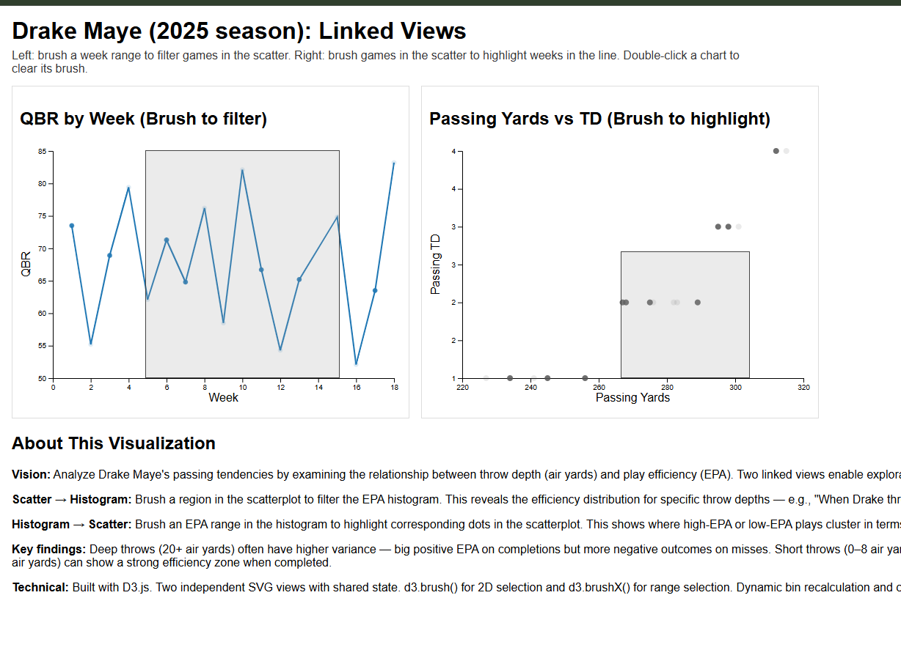

# A4 – Brushing & Linking (Drake Maye, 2025 season)
a4-adityaapatel-Aditya-Patel

## Live Demo
https://YOUR_GH_USERNAME.github.io/a4-linkedviews/

## Screenshot

## Dataset
Data is fetched from ESPN's public (undocumented) API as JSON and saved into this repo as a CSV:
`data/drake_maye_2025_gamelog.csv`.

## Views + Interactions (Linked Views)

**A (Line chart):** QBR by week  
- Brush a week range to filter which games are visible in the scatterplot.

**B (Scatterplot):** Passing yards vs passing TD by game  
- Brush games to highlight the corresponding weeks in the line chart.

Double-click either chart to clear its brush.

## Technical Achievements
- Two separate SVG views built using D3
- d3.brushX and d3.brush
- Shared interaction state + coordinated updates between views

## Design Achievements
- Clear encodings, axes, labels
- Simple instructions + reset behavior
